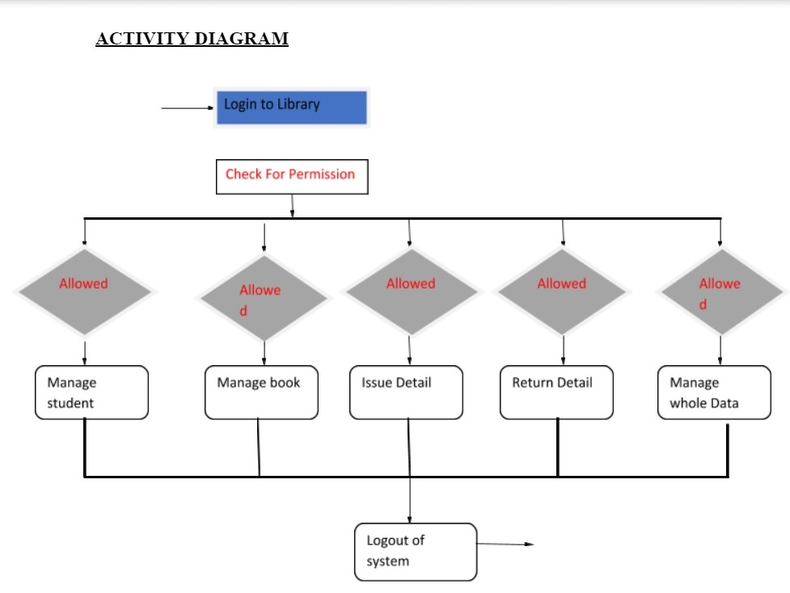
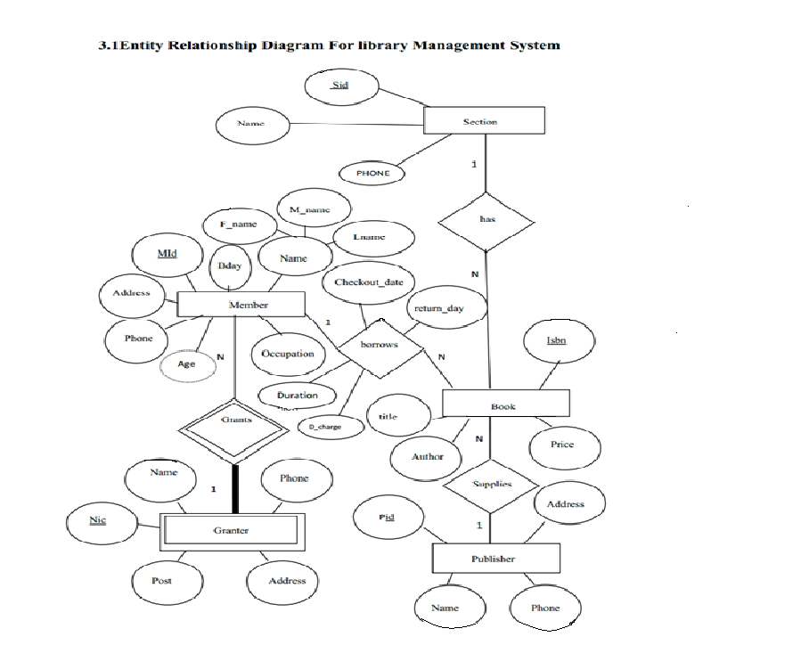
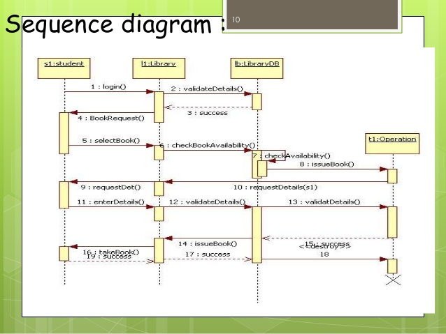
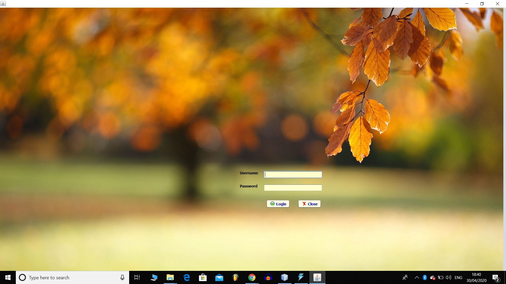
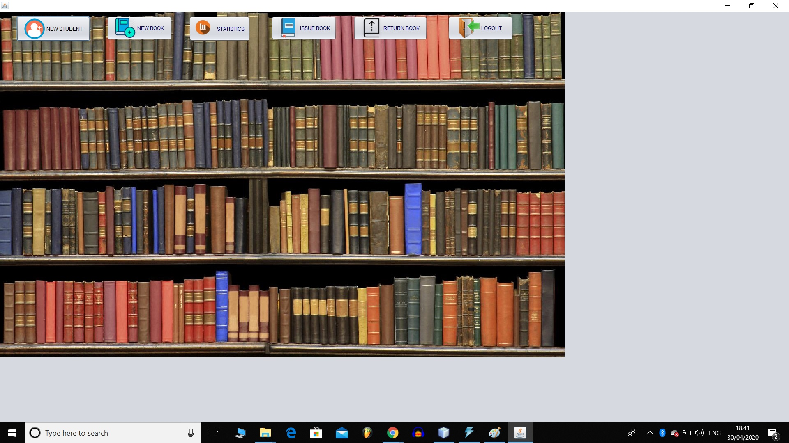
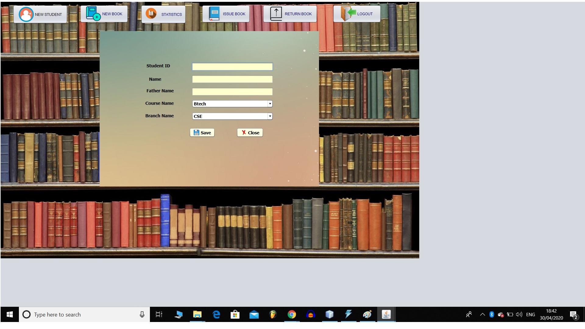
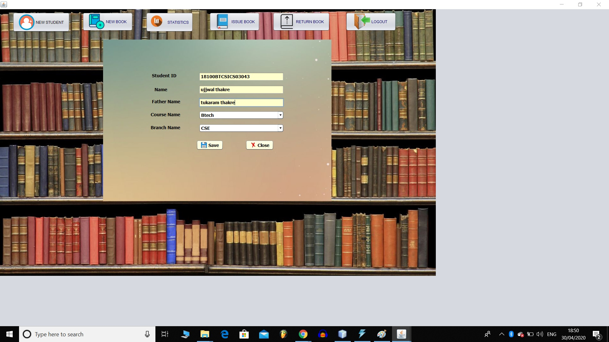
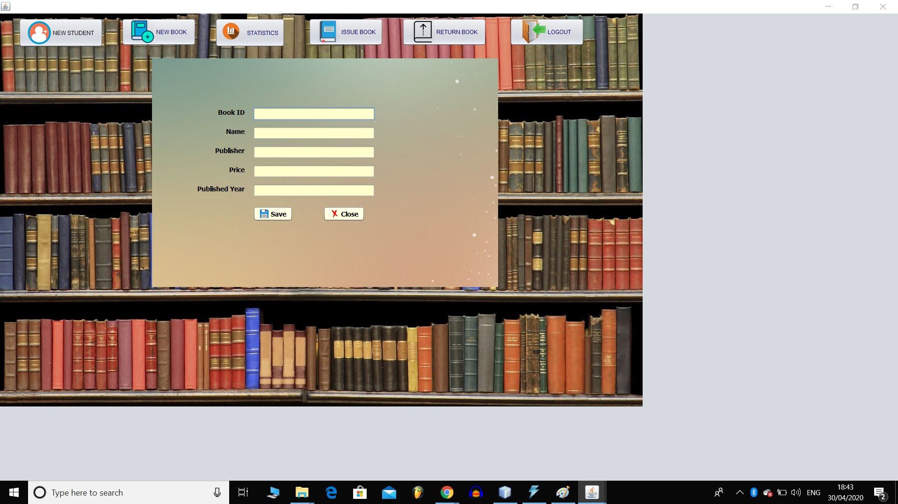
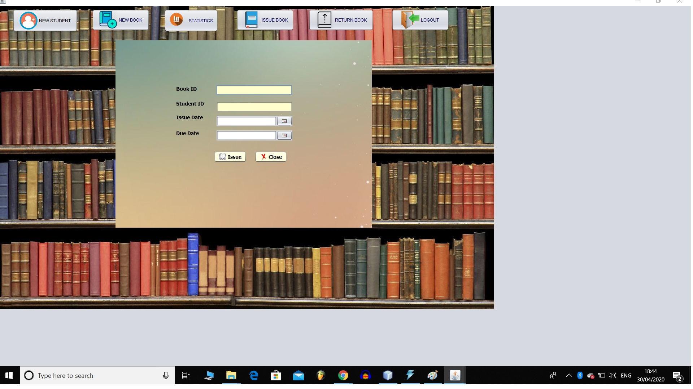
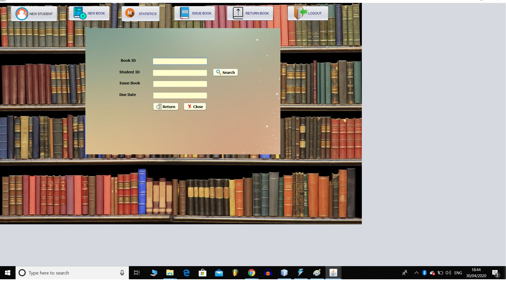

# Online-Library
ONLINE  LIBRARY  PROJECT
Objective:-
The objective and scope of my Project Library System is to record the details various activities of user. It will simplifies the task and reduse the paper work. During implementation every user will be given appropriate training to suit their specific needs. Specific support will also be provided at key points within the academic calendar. Training will be provided on a timely basis, and you will be trained as the new is Library System rolled out to your area of responsibility.

Functional  Requirements:-
Admin:
Can Login
Add Students
Add Books
Issue Books
Return Books
View Statistics
Can Logout
 
Software Specificatios:-
Operating System   	 : 	Windows 10/x-64
Languages  		 : 	java 
Front End	   	 : 	Swing
Platform		 : 	NetBeans IDE 8.2
Backend                             : 	MySQL

Classes of Library:-
Student class-Manages all the information about students.
New Student
Book Class-Manages all the information about books.
New Book
Issue Book
Return Book

Classes and their attributes:-
Student attributes: studentId,name,fatherName,courseName,branchName.
Book attributes: bookIdname,publisher,price,publishYear.
Issue attributes: bookId,studentId,issueDate,dueDate,returnBook.

CLASS DIAGRAM

 
ACTIVITY DIAGRAM

	

 

ER DIAGRAM

	

SEQUENTIAL DIAGRAM

How Project Works  
When we run the login file,a window will get open.

Write name and password: It must be admin for name and admin for password.

On logging in ,a home page gets open.

Click on New Student Button.

Fill the required details,

Now, click on New Book Button and fill the required details.

To issue book, click on Issue Book Button. Also , fill the details.   

To return book,click on Return Book Button.

Click on Statistics Button to view statistics of issued and returned book.

To logout,click on Logout button.

 Submitted by:
Ujjwal Thakre
18100BTCSICS03043
CS(ICS)
